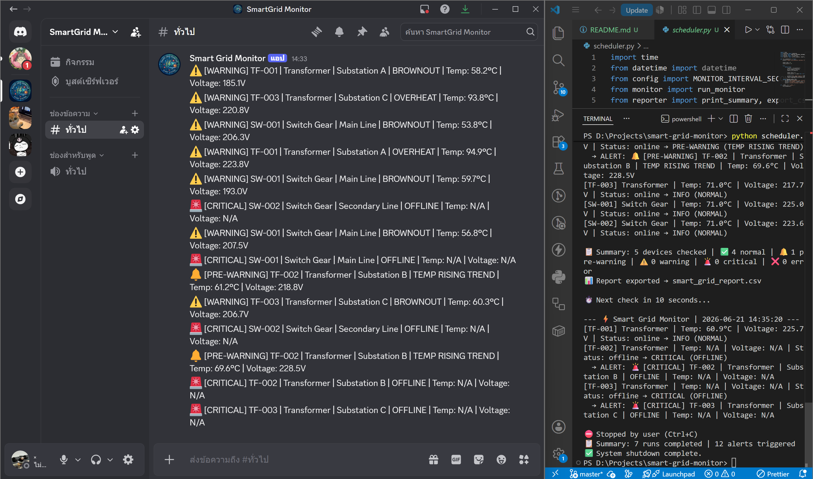

# ⚡ Smart Grid Monitor

**Python · Automation · Anomaly Detection · Predictive Alerting · Discord Webhook · Unit Testing**

> ระบบ Monitoring จำลองสำหรับ Smart Grid ที่ออกแบบมาเพื่อเฝ้าระวังสถานะอุปกรณ์ ตรวจจับความผิดปกติ และแจ้งเตือนเชิงรุกก่อนเกิดปัญหาจริง

A lightweight monitoring and alerting system that simulates Smart Grid devices, detects anomalies, identifies rising-risk conditions through trend analysis, and delivers real-time alerts via Discord.

---

## Smart Grid Monitor คืออะไร

Smart Grid Monitor เป็น Automation Script ที่จำลองการทำงานของระบบเฝ้าระวังอุปกรณ์ในโครงข่าย Smart Grid โดยใช้ข้อมูลจากหม้อแปลงไฟฟ้า (Transformer) และสวิตช์ตัดต่อ (Switch Gear) เพื่อจำลองสถานการณ์การตรวจสอบสถานะอุปกรณ์แบบ Real-time

โปรเจกต์นี้มุ่งเน้นการพัฒนาระบบ Monitoring และ Alerting ในรูปแบบ Modular Architecture สำหรับงานด้าน Digital Engineering โดยรองรับการตรวจจับความผิดปกติหลายประเภทพร้อมกัน (Multi-reason Detection) การคาดการณ์แนวโน้มก่อนเกิดปัญหาจริง (Predictive Alerting) และการแจ้งเตือนแบบ Real-time ผ่าน Discord Webhook

นอกจากการตรวจจับเหตุการณ์ที่เกิดขึ้นแล้ว ระบบยังสามารถวิเคราะห์แนวโน้มอุณหภูมิที่เพิ่มขึ้นต่อเนื่อง เพื่อแจ้งเตือนล่วงหน้าก่อนที่ค่าจะเกิน Threshold ที่กำหนด ช่วยให้สามารถเฝ้าระวังและตอบสนองต่อความเสี่ยงได้ตั้งแต่ระยะเริ่มต้น

เป้าหมายของโปรเจกต์คือการจำลองแนวคิดของระบบ Monitoring ในระดับ Production โดยใช้ Severity Levels เพื่อจัดลำดับความสำคัญของเหตุการณ์ แทนการตรวจสอบแบบ Reactive ที่รอให้เกิดปัญหาขึ้นก่อนแล้วจึงแจ้งเตือน

---

## Features

- **Multi-device Monitoring** — ตรวจสอบอุปกรณ์ 5 ตัวพร้อมกันในแต่ละรอบ ครอบคลุมทั้ง Transformer และ Switch Gear
- **Multi-reason Anomaly Detection** — ตรวจจับและรายงานความผิดปกติได้หลายประเภทพร้อมกันในอุปกรณ์เดียว เช่น อุณหภูมิสูงและแรงดันไฟตก โดยแสดงทุกสาเหตุที่ตรวจพบภายในรอบการตรวจสอบเดียวกัน
- **Predictive Alerting** — แจ้งเตือนล่วงหน้าด้วยสถานะ PRE-WARNING เมื่อตรวจพบแนวโน้มอุณหภูมิที่เพิ่มขึ้นอย่างต่อเนื่อง แม้ค่ายังไม่เกิน Threshold ที่กำหนด
- **Severity Levels** — แบ่งระดับความรุนแรงเป็น CRITICAL, WARNING, PRE-WARNING และ INFO เพื่อช่วยจัดลำดับความสำคัญของการตอบสนองต่อเหตุการณ์
- **Discord Webhook Integration** — ส่งการแจ้งเตือนแบบ Real-time ไปยัง Discord พร้อมแสดงข้อมูลสำคัญ เช่น Temperature และ Voltage ในแต่ละ Alert
- **Runtime Logging** — บันทึกผลการตรวจสอบและเหตุการณ์ที่เกิดขึ้นในแต่ละรอบลงไฟล์ `smart_grid.log` พร้อม Timestamp สำหรับการตรวจสอบย้อนหลัง
- **CSV Reporting** — สร้างรายงานสรุปผลการตรวจสอบในรูปแบบ CSV และบันทึกลง `smart_grid_report.csv` อัตโนมัติ
- **Graceful Shutdown & Run Summary** — รองรับการหยุดระบบด้วย Ctrl+C อย่างปลอดภัย พร้อมสรุปจำนวนรอบการทำงานและเหตุการณ์ที่ตรวจพบก่อนปิดโปรแกรม

---

## Tech Stack

| Category | Technology |
|---|---|
| Language | Python 3.10+ |
| Standard Library | `csv`, `logging`, `datetime`, `random`, `time`, `unittest` |
| External Dependency | `requests` (Discord Webhook Integration) |
| Testing Framework | `unittest` (14 test cases) |

---

## Project Structure & Architecture

โปรเจกต์นี้ถูกออกแบบในรูปแบบ Modular Architecture โดยแยกแต่ละส่วนของระบบออกตามหน้าที่รับผิดชอบ (Separation of Concerns) ทำให้โค้ดอ่านง่าย ดูแลรักษาได้สะดวก และสามารถขยายความสามารถของระบบในอนาคตได้โดยไม่กระทบส่วนอื่น

```
smart-grid-monitor/
├── config.py            # Thresholds, device list, Discord Webhook URL (ไม่ push ขึ้น GitHub)
├── config.example.py    # Template config สำหรับ reference (ไม่มี URL จริง)
├── simulator.py         # Mock sensor data generator
├── monitor.py           # Core detection logic — anomaly detection + predictive alerting
├── alert.py             # Alert dispatcher — severity levels + Discord Webhook
├── reporter.py          # Summary printer + CSV exporter
├── scheduler.py         # Auto-loop runner พร้อม graceful shutdown
├── test_monitor.py      # Unit tests (14 test cases)
├── requirements.txt
└── README.md
```

### Data Flow

```
config.py ──────────────────────────────────────┐
                                                ▼
simulator.py ── generates sensor data ────▶ monitor.py ──▶ alert.py (Discord + print)
                                                │
                                                └──▶ smart_grid.log

scheduler.py ── calls monitor.py in a loop ──▶ reporter.py (summary + CSV)
```

### Component Responsibilities

- **config.py** — จัดเก็บ Threshold, รายชื่ออุปกรณ์ และค่าการตั้งค่าต่าง ๆ ของระบบ เพื่อหลีกเลี่ยงการ Hard-code ภายในโค้ด
- **simulator.py** — จำลองข้อมูลจาก Sensor เพื่อสร้างสถานการณ์สำหรับการทดสอบและสาธิตการทำงานของระบบ
- **monitor.py** — ศูนย์กลางของระบบ ทำหน้าที่วิเคราะห์ข้อมูล ตรวจจับความผิดปกติ และประเมินแนวโน้มความเสี่ยงล่วงหน้า
- **alert.py** — จัดการการแจ้งเตือนตามระดับความรุนแรง พร้อมส่งข้อความผ่าน Discord Webhook
- **reporter.py** — สรุปผลการตรวจสอบและสร้างรายงานในรูปแบบ CSV หลังจบแต่ละรอบการทำงาน
- **scheduler.py** — ควบคุมการทำงานแบบต่อเนื่อง โดยเรียกใช้งาน Monitoring Engine ตามช่วงเวลาที่กำหนด

---

## Anomaly Conditions

ระบบตรวจสอบอุปกรณ์แต่ละตัวตามชุดกฎที่กำหนดไว้ล่วงหน้า เมื่อพบเงื่อนไขที่ตรงกัน ระบบจะกำหนดระดับความรุนแรงและสร้าง Alert ที่เหมาะสมโดยอัตโนมัติ

| Condition | Severity | Trigger |
|---|---|---|
| Device Offline | CRITICAL | `status == "offline"` |
| Overheating | WARNING | `temp > 75°C` |
| Voltage Drop (Brownout) | WARNING | `voltage < 210V` |
| Multiple Anomalies Detected | WARNING (multi-reason) | `reasons = ['OVERHEAT', 'BROWNOUT']` |
| Rising Temperature Trend | PRE-WARNING | อุณหภูมิขึ้น ≥ 2°C ติดต่อกัน 3 รอบ |
| Normal Operation | INFO | ไม่มี Condition ใดถูก Trigger |

---

## Getting Started

### 1. Install Dependencies

```bash
pip install -r requirements.txt
```

### 2. Configure the Application

```bash
cp config.example.py config.py
```

เปิด `config.py` แล้วกำหนดค่า Discord Webhook URL (ไม่บังคับ)

> หากไม่ได้กำหนด Webhook URL ระบบจะยังคงทำงานตามปกติ แต่จะข้ามการส่งแจ้งเตือนไปยัง Discord

### 3. Run Once

```bash
python monitor.py
```

### 4. Run Continuously

```bash
python scheduler.py
```

ระบบจะทำการตรวจสอบอุปกรณ์ทุก 10 วินาทีตามค่าเริ่มต้น

กด `Ctrl+C` เพื่อหยุดการทำงานอย่างปลอดภัย

---

## Run Tests

```bash
python test_monitor.py
```

Example output:

```
Ran 14 tests in 0.003s

OK
```

ชุดทดสอบจำนวน 14 Test Cases ครอบคลุมการทำงานหลักของระบบ ได้แก่

- Normal values
- Boundary conditions
- Anomaly detection ทุกประเภท
- Predictive trend detection
- Multi-reason detection
- Edge cases และ Invalid inputs
- Priority logic (Trend detection skipped when WARNING exists)

---

## Sample Output

ตัวอย่าง Output จากหนึ่งรอบการตรวจสอบ แสดงการทำงานครบทุกประเภท ได้แก่ สถานะปกติ การตรวจจับ Anomaly การแจ้งเตือนเชิงรุก และการสรุปผลหลังจบรอบ

```
--- ⚡ Smart Grid Monitor | 2026-06-21 14:32:01 ---
[TF-001] Transformer | Temp: 62.3°C | Voltage: 223.0V | Status: online → INFO (NORMAL)
[TF-002] Transformer | Temp: 76.1°C | Voltage: 218.0V | Status: online → WARNING (OVERHEAT)
  → ALERT: ⚠️ [WARNING] TF-002 | Transformer | Substation B | OVERHEAT | Temp: 76.1°C | Voltage: 218.0V
[TF-003] Transformer | Temp: 71.0°C | Voltage: 207.0V | Status: online → WARNING (BROWNOUT)
  → ALERT: ⚠️ [WARNING] TF-003 | Transformer | Substation C | BROWNOUT | Temp: 71.0°C | Voltage: 207.0V
[SW-001] Switch Gear | Temp: N/A | Voltage: N/A | Status: offline → CRITICAL (OFFLINE)
  → ALERT: 🚨 [CRITICAL] SW-001 | Switch Gear | Main Line | OFFLINE | Temp: N/A | Voltage: N/A
[SW-002] Switch Gear | Temp: 68.0°C | Voltage: 221.0V | Status: online → PRE-WARNING (TEMP RISING TREND)
  → ALERT: 🔔 [PRE-WARNING] SW-002 | Switch Gear | Secondary Line | TEMP RISING TREND | Temp: 68.0°C | Voltage: 221.0V

📋 Summary: 5 devices checked | ✅ 1 normal | 🔔 1 pre-warning | ⚠️ 2 warning | 🚨 1 critical | ❌ 0 error
📊 Report exported → smart_grid_report.csv
```

---

## Screenshot

ตัวอย่างการแจ้งเตือนผ่าน Discord ควบคู่กับ Terminal Output แสดง Alert ระดับ WARNING, CRITICAL และ PRE-WARNING พร้อม Run Summary หลังกด Ctrl+C



---

## Notable Implementation Examples

ตัวอย่างด้านล่างแสดงแนวคิดการออกแบบหลักของระบบในแต่ละ Layer ตั้งแต่การตรวจจับความผิดปกติ การจัดการการแจ้งเตือน ไปจนถึงการทดสอบ เพื่อให้แต่ละส่วนมีหน้าที่รับผิดชอบชัดเจนและสามารถขยายต่อได้ง่าย

### Detection & Predictive Layer

[`monitor.py`](https://github.com/ctrlfaith/smart-grid-monitor/blob/main/monitor.py)

เป็นศูนย์กลางของระบบ ทำหน้าที่วิเคราะห์ข้อมูลจากอุปกรณ์และตรวจจับความผิดปกติตามเงื่อนไขที่กำหนด โดยรองรับการตรวจจับหลายเหตุการณ์พร้อมกันในอุปกรณ์เดียว (Multi-reason Detection) แทนการหยุดประมวลผลเมื่อพบความผิดปกติรายการแรก

นอกจากนี้ยังมีการวิเคราะห์แนวโน้มอุณหภูมิผ่าน `_detect_trend()` ซึ่งใช้ข้อมูลย้อนหลัง 3 รอบการทำงานเพื่อตรวจจับการเพิ่มขึ้นของอุณหภูมิอย่างต่อเนื่อง และแจ้งเตือนในระดับ PRE-WARNING ก่อนที่ค่าจะเกิน Threshold จริง

---

### Alert Dispatch Layer

[`alert.py`](https://github.com/ctrlfaith/smart-grid-monitor/blob/main/alert.py)

รับผลลัพธ์จาก Monitoring Engine และจัดการการแจ้งเตือนตามระดับความรุนแรงของเหตุการณ์ โดยแต่ละ Alert จะประกอบด้วยข้อมูลสำคัญ เช่น Device ID, Temperature และ Voltage เพื่อช่วยให้ผู้รับแจ้งเตือนสามารถประเมินสถานการณ์ได้ทันที

การแยกส่วน Alert Dispatch ออกจาก Detection Logic ช่วยลดการพึ่งพากันระหว่างโมดูล และเปิดโอกาสให้สามารถเพิ่มช่องทางการแจ้งเตือนอื่น ๆ เช่น Email หรือ LINE ได้ในอนาคตโดยไม่ต้องแก้ไข Detection Layer

---

### Test Coverage Layer

[`test_monitor.py`](https://github.com/ctrlfaith/smart-grid-monitor/blob/main/test_monitor.py)

ประกอบด้วย 14 Test Cases ที่ครอบคลุมทั้งการทำงานปกติ (Normal Values), Boundary Conditions, การตรวจจับความผิดปกติทุกประเภท, Predictive Trend Detection, Multi-reason Detection, Edge Cases และ Priority Logic

ชุดทดสอบถูกออกแบบให้ตรวจสอบทั้งผลลัพธ์ที่คาดหวังและพฤติกรรมของระบบในสถานการณ์ที่อาจเกิดขึ้นจริง เพื่อช่วยลดความเสี่ยงจากการเปลี่ยนแปลงโค้ดในอนาคตและเพิ่มความมั่นใจในการทำงานของ Detection Logic

การใช้ `assertIn()` แทน `assertEqual()` สำหรับ Multi-reason Detection ช่วยให้การทดสอบไม่ขึ้นอยู่กับลำดับของเหตุการณ์ที่ตรวจพบ และสะท้อนพฤติกรรมจริงของระบบที่สามารถรายงานหลายความผิดปกติพร้อมกันได้

---

## Development Approach

โปรเจกต์นี้ถูกพัฒนาแบบเป็นลำดับขั้นโดยแบ่งงานออกเป็น 5 Sprint เพื่อกำหนดเป้าหมายและขอบเขตงานของแต่ละช่วงอย่างชัดเจน ตั้งแต่การวางโครงสร้างระบบ การพัฒนา Detection Logic ไปจนถึงการทดสอบและจัดทำเอกสารประกอบ

- Sprint 1 — Foundation (config + simulator)
- Sprint 2 — Core Detection Logic (monitor + logging)
- Sprint 3 — Alerting & Reporting (alert + reporter)
- Sprint 4 — Automation & Testing (scheduler + unit tests)
- Sprint 5 — Documentation & Polish (README + code review)

---

## Author

Designed, Developed and Maintained by **Phuriphat Rattanatham**

- Portfolio · [ctrlfaith-portfolio.vercel.app](https://ctrlfaith-portfolio.vercel.app)
- GitHub · [github.com/ctrlfaith](https://github.com/ctrlfaith)
